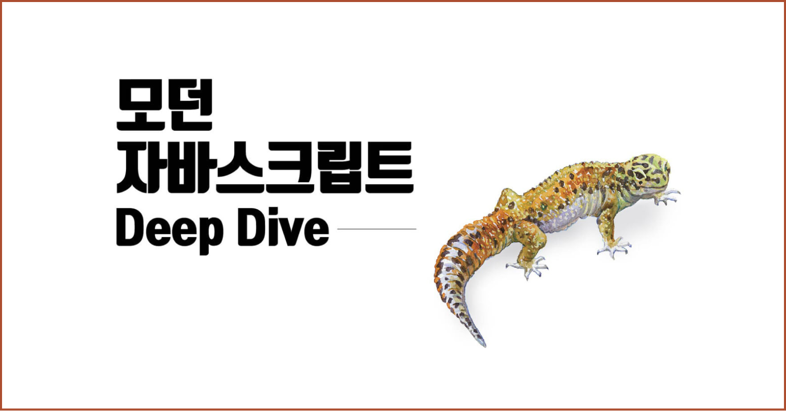

# study-js-deep-dive

## 스터디 멤버

|       |   |  |  |
|:------------------------------------------------:|:--------------------------------------------:|:---------------------------------------------:|:--------------------------------------------:|
|         [김민정](https://github.com/minjj0905)         |       [박지영](https://github.com/parkyolo)       |      [박진아](https://github.com/dev-hamster)       |      [서범석](https://github.com/beomxtone)       |
|                목표                |             목표              |      목표       |              목표               |

## 스터디 시간

일시 : 매주 화요일 18:30 ~ 20:30

장소 : 어딘가

## 스터디 진행방식

- 매 주 진행자를 선정한다.
- 매 주마다 Issue를 생성해 관리하고, 목차 하나마다 Pull Request를 올린다.
- 오프라인 스터디를 진행할 때, comment 및 merge 작업을 진행한다.
- 마지막 주가 끝나면 다음 목차 범위를 정한다.

## 스터디 규칙
- Limit 2 hours
- 진행자는 다른 사람들이 책을 읽었는지 확인하기 위해 퀴즈를 준비할 수 있다.
- 진행자가 자료를 준비하지 못했거나, 책을 읽어오지 않은 사람은 당일 커피 값을 계산한다.

## TODO 
- ~~pr 템플릿 작성 범석님~~ `완료`
- 마크다운 템플릿 범석님 `진행중`

## 스터디 일정
| 회차 | 이름 | 목차 |
|---|---|---|
|1주차 | 서범석 | 4 5 6 |
|2주차 | 박진아 | 7 8 9(~9.3) |
|3주차 | 박지영 | 9(9.4~) 10 11 |
|4주차 | 김민정 | 12 13 |
