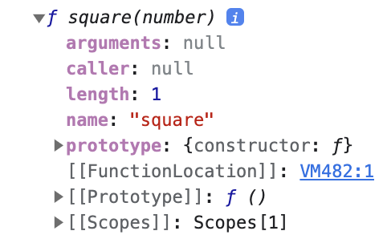

## 18장 함수와 일급 객체

---

### 18.1 일급객체

다음 조건을 만족하는 객체를 **일급 객체**라 한다.

1. 무명의 리터럴로 생성할 수 있다. 즉, 런타임에 생성이 가능하다.
2. 변수나 자료구조(객체, 배열 등)에 저장할 수 있다.
3. 함수의 매개변수에 전달할 수 있다.
4. 함수의 반환값으로 사용할 수 있다.

자바스크립트의 **함수는 일급 객체**이다.

```jsx
// 1. 함수는 무명의 리터럴로 생성할 수 있다.
// 2. 함수는 변수에 저장할 수 있다.
// 런타임(할당 단계)에 함수 리터럴이 평가되어 함수 객체가 생성되고 변수에 할당된다.
const increase = function (num) {
  return ++num;
};

const decrease = function (num) {
  return --num;
};

// 2. 함수는 객체에 저장할 수 있다.
const auxs = { increase, decrease };

// 3. 함수의 매개변수에 전달할 수 있다.
// 4. 함수의 반환값으로 사용할 수 있다.
function makeCounter(aux) {
  let num = 0;

  return function () {
    num = aux(num);
    return num;
  };
}

// 3. 함수는 매개변수에게 함수를 전달할 수 있다.
const increaser = makeCounter(auxs.increase);
console.log(increaser()); // 1
console.log(increaser()); // 2

// 3. 함수는 매개변수에게 함수를 전달할 수 있다.
const decreaser = makeCounter(auxs.decrease);
console.log(decreaser()); // -1
console.log(decreaser()); // -2
```

함수는 일급객체이므로 값과 동일하게 취급할 수 있다.  
따라서 값을 사용할 수 있는 곳 (변수 할당문, 객체 프로퍼티, 배열 요소, 함수 인수, 반환문) 어디든 리터럴로 정의할 수 있고, 런타임에 함수 객체로 평가된다.

> 💡 일급객체로서 함수는 일반 객체와 같이 함수의 매개변수에 전달 가능하며, 반환값으로 사용할 수 있다.  
> 이는 함수형 프로그래밍을 가능하게 하는 자바스크립트의 장점이다.

<br />
<br />

### 18.2 함수 객체의 프로퍼티

```jsx
function square(number) {
  return number * number;
}
console.dir(square);
```

다음 코드를 브라우저에서 실행 시 다음과 같은 결과가 나온다.



<br />

```jsx
function square(number) {
  return number * number;
}

console.log(Object.getOwnPropertyDescriptors(square));
/*
{
	length: {value: 1, writable, enumerable, configurable},
	name: {value: "square", ...},
	arguments: {value: null, ...},
	caller: {value: null, ...},
	prototype: {value: { ... }, ...}
}
*/

// __proto__는 square 함수의 프로퍼티가 아니다.
console.log(Object.getOwnPropertyDescriptor(square, '__proto__')); // undefined

// __proto__는 Object.prototype 객체의 접근자 프로퍼티다.
// sqaure 함수는 Object.prototype 객체로부터 __proto__ 접근자 프로퍼티를 상속받는다.
console.log(Object.getOwnPropertyDescriptor(Object.prototype, '__proto__'));
// {get: f, set: f, enumerable: false, configurable: true}
```

- `arguments`, `caller`, `length`, `name`, `prototype` : 데이터 프로퍼티
- `__proto__` : 접근자 프로퍼티로 `Object.prototype` 객체의 프로퍼티를 상속받음

모든 객체는 `Object.prototype` 객체의 프로퍼티를 상속받아 사용할 수 있고, `__proto__` 접근자 프로퍼티는 모든 객체가 사용 가능한다.

<br />
<br />

**`arguments` 프로퍼티**

함수 호출 시 전달된 인수들의 정보를 담고있는 순회 가능한 유사 배열 객체이다.  
함수 내부에서만 참조할 수 있다.  
_ES3부터 표준에서 폐지되었음_

```jsx
function multiply(x, y) {
  return x * y;
}

multifly(); // NaN, arguments: { callee, length, Symbol(Symbol.iterator), __proto__ }
multifly(1); // NaN, arguments: {0: 1, ...}
multifly(1, 2); // 2, arguments: {0: 1, 1: 2, ...}
multifly(1, 2, 3); // 2, arguments: {0: 1, 1: 2, 2: 3, ...}
```

`arguments` 객체는 인수를 프로퍼티 값으로 소유하는데, 이때 프로퍼티 키는 인수의 순서이다.

- callee : arguments 객체를 생성한 함수, 즉 함수 자신
- length : 인수의 개수

<details>
<summary>Symbol(Symbol.iterator)</summary>

arguments 객체를 순회 가능한 자료구조인 **이터러블** 로 만들기 위한 프로퍼티

Symbol.iterator를 프로퍼티 키로 사용한 메서드를 구현하는 것에 의해 이터러블이 된다.

```jsx
function multiply(x, y) {
  // 이터레이터
  const iterator = arguments[Symbol.iterator]();

  // 이터레이터의 next 메서드를 호출하여 이터러블 객체 arguments를 순회
  console.log(iterator.next()); // {vaule: 1, done: false}
  console.log(iterator.next()); // {vaule: 2, done: false}
  console.log(iterator.next()); // {vaule: 3, done: false}
  console.log(iterator.next()); // {vaule: undefined, done: true}

  return x * y;
}

multiply(1, 2, 3);
```

</details>

<br />

`arguments` 객체는 가변 인자 함수를 구현할 때 유용하다.

```jsx
function sum() {
  let res = 0;

  // arguments 객체는 length 프로퍼티가 있는 유사 배열 객체이므로 for문 순회 가능
  for (let i = 0; i < arguments.length; i++) {
    res += arguments[i];
  }

  return res;
}

console.log(sum()); // 0
console.log(sum(1, 2)); // 3
console.log(sum(1, 2, 3)); // 6
```

`arguments` 는 유사 배열 객체이다.

<details>
  <summary>유사 배열 객체와 이터러블</summary>

ES6에서 도입된 이터레이션 프로토콜을 준수하면 순회 가능한 자료구조인 이터러블이 된다.

- ~ ES5 : 유사 배열 객체
- ES6 : 유사배열객체이면서 동시에 이터러블

</details>
<br/>

유사 배열 객체는 배열이 아니므로 배열 메서드를 사용하면 에러가 발생한다.  
→ Function.prototype.call, Function.prototype.apply를 사용해 간접 호출해야 한다.

```jsx
function sum() {
  // arguments 객체를 배열로 변환
  const array = Array.prototype.call(arguments);
  return array.reduce((pre, cur) => pre + cur, 0);
}

console.log(sum(1, 2, 3, 4, 5)); // 15
```

이러한 번거로움 해결을 위해 ES6에서 Rest 파라미터(나머지 파라미터)가 도입되었다.

```jsx
// ES6 Rest parameter
function sum(...args) {
  return args.reduce((pre, cur) => pre + cur, 0);
}

console.log(sum(1, 2)); // 3
console.log(sum(1, 2, 3, 4, 5)); // 15
```

> 💡 ES6 Rest 파라미터의 도입으로 모던 자바스크립트에서는 arguments 객체의 중요성이 예전같지 않다.  
> 심지어 화살표 함수에는 arguments 객체가 존재하지 않는다.

<br />

**`caller` 프로퍼티**

함수 자신을 호출한 함수를 가리킨다.  
_ES 사양에 포함되지 않았으며 앞으로도 포함되지 않을 예정인 프로퍼티이다._

```jsx
function foo(func) {
  return func();
}

function bar() {
  return 'caller : ' + bar.caller;
}

// 브라우저에서 실행한 결과
console.log(foo(bar)); // caller : function foo(func) {...}
cosnole.log(bar()); // caller : null
```

_Node.js 환경에서는 다른 결과가 나온다. → 48장 "모듈"_

<br />

**`length` 프로퍼티**

함수를 정의할 때 선언한 매개변수의 개수를 의미한다.

```jsx
function foo() {}
console.log(foo.length); // 0

function bar(x) {};
console.log(bar.length); // 1

function baz(x, y) {};
console.log(baz.length(; // 2
```

> 🚨 arguments의 length는 인자의 개수이고 함수 객체의 length는 파라미터의 개수이므로 다를 수 있음에 주의하자.

<br />
<br />

**`name` 프로퍼티**

함수의 이름을 나타내며, ES6부터 표준이 되었다.  
익명 함수 표현식의 경우 ES5까지는 빈 문자열이었으나, ES6부터는 함수 객체를 가리키는 식별자를 값으로 가진다.

```jsx
// 기명 함수 표현식
var namedFunc = function foo() {};
console.log(namedFunc.name); // foo

// 익명 함수 표현식
var anonymousFunc = function () {};
// ES5: name 프로퍼티는 빈 문자열을 값으로 갖는다.
// ES6: name 프로퍼티는 함수 객체를 가리키는 변수 이름을 값으로 갖는다.
console.log(anonymousFunc.name); // anonymousFunc

// 함수 선언문(Function declaration)
function bar() {}
console.log(bar.name); // bar
```

> ❗️ **함수 이름**과 함수 객체를 가리키는 **식별자**는 의미가 다르다는 데 주의하자.

<br />
<br />

**`__proto__` 접근자 프로퍼티**

모든 객체는 `[[Prototype]]`이라는 내부 슬롯을 가진다.  
`[[Prototype]]`은 객체지향 프로그래밍의 상속을 구현하는 프로토타입 객체를 가리킨다. _19장 "프로토타입"_

`__proto__` 프로퍼티는 `[[Prototype]]`이 가리키는 프로토타입 객체에 접근하기 위해 사용하는 **접근자 프로퍼티**이다.  
`[[Prototype]]` 내부 슬롯에는 직접 접근할 수 없으며, `__proto__`을 통해 간접적 접근이 가능하다.

```jsx
const obj = { a: 1 };

// 객체 리터럴 방식으로 생성한 객체의 프로토타입 객체는 Object.prototype이다.
console.log(obj.__proto__ === Object.prototype); // true

// 객체 리터럴 방식으로 생성한 객체는 프로토타입 객체인 Object.prototype의 프로퍼티를 상속받는다.
// hasOwnProperty 메서드는 Object.prototype의 메서드다.
console.log(obj.hasOwnProperty('a')); // true
console.log(obj.hasOwnProperty('__proto__')); // false
```

<details>
<summary>hasOwnProperty 메서드</summary>

인수로 전달받은 프로퍼티 키가 객체 고유의 프로퍼티 키인 경우에만 true를 반환하고, 상속받은 프로토타입의 프로퍼티 키인 경우 false를 반환한다.

</details>

<br />
<br />

**`prototype` 프로퍼티**

생성자 함수로 호출할 수 있는 함수 객체인 `constructor`만이 소유하는 프로퍼티이다.

```jsx
// 함수 객체는 prototype 프로퍼티를 소유한다.
(function () {}).hasOwnProperty('prototype'); // true

// 일반 객체는 prototype 프로퍼티를 소유하지 않는다.
({}).hasOwnProperty('prototype'); // false
```
