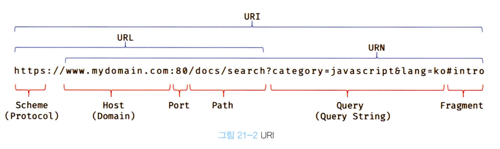

## 21장: 빌트인 객체

---

### **21.1 자바스크립트 객체의 분류**

자바스크립트 객체는 크게 3개의 객체로 분류할 수 있다.

- 표준 빌트인 객체<sup>standard built-in objects/native objects/global objects</sup>

- 호스트 객체<sup>host objects</sup>

- 사용자 정의 객체<sup>user-defined objects</sup>

</br>

### **21.2 표준 빌트인 객체**

`Math`, `Reflect`, `JSON`을 제외한 표준 빌트인 객체는 생성자 함수 객체다.

```jsx
const strObj = new String("hey"); // String {"Lee"}
console.log(typeof strObj); // object

const numObj = new Number(123); // Number {123}
console.log(typeof numObj); // object

const boolObj = new Boolean(true); // Boolean {true}
console.log(typeof boolObj); // object

// ...
```

표준 빌트인 객체의 **인스턴스의 프로토타입** - 표준 빌트인 객체의 **prototype 프로퍼티**에 바인딩된 객체

<details>
<summary>
이게 무슨 소리인가?
</summary>

```jsx
const strObj = new String("hey");
console.log(Object.getPrototypeOf(strObj) === String.prototype); // true
```

즉 String으로 생성한 instance는 String의 prototype을 가진다는 뜻

</details>

<br/>

또한 표준 빌트인 객체는 인스턴스 없이 호출 가능한 **빌트인 정적 메서드**를 제공한다.  
무슨 소린지 이해가 안가므로 예시를 보자.

```jsx
const numObj = new Number(3.14);

// Number.prototype.toFixed: 반올림 후 문자열로 반환
console.log(numObj.toFixed()); // 3

// Number의 정적 메서드 isInteger: 정수인지 검사하여 Boolean 반환
console.log(Number.isInteger(3.14)); // false
```

</br>

### **21.3 원시값과 래퍼 객체**

문자열, 숫자 등의 원시값이 있는데 `String`, `Number` 등 빌트인 객체는 왜쓸까?

```jsx
const str = "hey";

console.log(str.length); // 3
console.log(str.toUpperCase()); // HEY
```

`str`이라는 원시값은 **프로퍼티**나 **메서드**를 가질 수 없지만 객체처럼 동작한다.

1. 이는 **또! 자바스크립트 엔진**이 마침표 표기법으로 접근할 때 일시적으로 연관된 객체로 바꿔주기 때문이다. (끝나면 원시값으로 되돌린다.)

원시값을 객체처럼 접근할 때 생성되는 임시 객체를 **래퍼 객체<sup>wrapper object</sup>** 라 한다.

위의 예제에서 `str`은 `String.prototype`의 메서드를 상속받아 사용할 수 있다.

2. 래퍼 객체의 처리가 종료되면 `[[StringData]]` 내부 슬롯에 할당된 원시값으로 되돌리고, 래퍼 객체는 **가비지 컬렉션**의 대상이 된다.

다음의 이상한 예시를 보자.

```jsx
const str = "hey";
str.name = "hello"; // object가 아닌데 오류가 나지 않는다.

console.log(str.name); // undefined  ?
console.log(typeof str); // string
```

1. `str` String 원시값은 `.name` 마침표 표기법 접근으로 인해 **암묵적으로** 래퍼객체를 가리킨다.
2. 래퍼객체의 `name` 프로퍼티에 입력값이 동적 할당된다.
3. 래퍼객체의 처리가 종료되었으므로 `[[StringData]]`에 있는 `String`으로 되돌리고, 래퍼객체는 **가비지 컬렉션**에 의해 메모리가 해제된다.
4. `console.log(str.name)`에서 `.name` 마침표 표기법으로 접근하므로 다시 **암묵적으로** 래퍼객체를 가리킨다.
5. 새로 생성된 래퍼객체는 `name` 프로퍼티가 존재하지 않으므로 `undefined`
6. 다시 래퍼객체는 **가비지 컬렉션**에 의해 메모리 해제되고, `str`은 `String`이 된다.

</br>

`문자열`, `숫자`, `불리언`, `심벌`은 **암묵적으로 래퍼객체가 생성**되어 객체처럼 사용할 수 있다.

- 따라서 문자열, 숫자, 불리언은 `new` 연산자로 인스턴스를 생성하는 것을 권장하지 않는다.

`null`과 `undefined`는 래퍼객체를 생성하지 않으며 객체처럼 다루면 **에러**가 발생한다.  
`Symbol`은 추후 다루도록 한다.

</br>

### **21.4 전역 객체**

**전역 객체<sup>global object</sup>**

코드가 실행되기 이전, 자바스크립트 엔진에 의해 가장 먼저 생성되는 특수한 객체  
어떤 객체에도 속하지 않는 최상위 객체

- 브라우저: `window`
- node.js: `global`

<details>
<summary>globalThis</summary>

ES11에서 도입된 **통일된 식별자**

```jsx
// on browser
globalThis === this; // true
globalThis === window; // true

// on Node.js (^12.0.0)
globalThis === this; // true
globalThis === window; // true
```

</details>

</br>

**전역 객체가 갖는 프로퍼티**

- 표준 빌트인 객체 (`Object`, `Number`, `Function`, `Array` ...)
- 환경에 따른 **호스트 객체** (`Web API`, Node.js의 `호스트 API` ...)
- `var` 키워드로 선언한 **전역 변수**와 **전역 함수**

</br>

**전역 객체의 특징**

- 개발자가 의도적으로 생성 불가

  - 전역 객체의 생성자 함수는 제공되지 않는다.

- 전역 객체의 프로퍼티를 참고할 때, `window`(or `global`)는 생략할 수 있다.

  - `window.parseInt === parseInt`

- 모든 **표준 빌트인 객체**(Object, Number, ...)를 프로퍼티로 갖는다.

- JS 실행 환경에 따라 추가적으로 프로퍼티와 메서드를 갖는다.

  - 브라우저의 클라이언트 사이드 `Web API`를 `호스트 객체`로 제공
    - DOM, BOM, Canvas, fetch, XMLHTTPRequest, SVG, Web Storage, ...
  - Node.js의 **고유 API**인 `호스트 객체`

- `var`로 선언한 **전역 변수** 및 **전역 함수**, 선언 없는 **암묵적 전역**의 값을 프로퍼티로 갖는다.

  - `var foo;` -> `window.foo` // 전역 변수
  - `bar = 2;` -> `window.bar` // 암묵적 전역

- `let`, `const`로 선언한 **전역 변수**는 전역 객체의 프로퍼티가 아니다.

  - 전역 렉시컬 환경의 선언적 환경 레코드 내에 존재 (23장: 실행 컨텍스트)

- 브라우저의 모든 JS 코드는 하나의 전역객체 `window`를 공유한다.

</br>

### 21.4.1 빌트인 전역 프로퍼티

**빌트인 전역 프로퍼티<sup>built-in global property</sup>**  
그냥 전역 객체의 프로퍼티다.

- `Infinity`
- `NaN`
- `undefined` : `window.undefined`로도 쓸 수 있다.

</br>

### 21.4.2 빌트인 전역 함수

**빌트인 전역 함수<sup>built-in global function</sup>**  
그냥 전역 객체의 메서드다.

- `eval`

자바스크립트 코드를 가진 문자열을 인수로 받는다.

설명 대신 예시를 보자.

```jsx
eval("1 + 2"); // 3

const o = eval("({ r: 1 })"); // 객체, 함수 리터럴은 괄호로 둘러싼다.
console.log(o); // {r: 1}

eval("var x = 1; console.log(1);"); // 1

// 이건 되고
eval("const x = 1; console.log(x)"); // 1
// 이건 안된다
eval("const x = 1");
console.log(x); // ReferenceError: x is not defined
eval("console.log(x)"); // ReferenceError: x is not defined
// const는 블록 레벨 스코프를 따르기 때문일 듯 하다.
```

`eval`함수는 보안에 매우 취약할 뿐더러, 자바스크립트 엔진의 최적화가 수행되지 않아 느리다.

따라서, `eval` 함수의 시용은 **금지**한다. ~~그럼 왜 적은걸까요~~

> `eval`은 보안성의 이유로 웹 페이지마다 막혀있는 경우가 있다.

```jsx
// on Chrome First page
eval("const x = 1");
// This document requires 'TrustedScript' assignment.
// Uncaught EvalError: Refused to evaluate a string as JavaScript because 'unsafe-eval' is not an allowed ...

// on Google or Naver
eval("const x = 1");
console.log(x);
// Uncaught ReferenceError: x is not defined
```

- `isFinite`

무한이거나 `NaN`으로 평가되는 값이면 `false`를 반환

```jsx
isFinite(0); // true
isFinite(null); // true: null -> 0

isFinite(Infinity); // false
isFinite(NaN); // false
isFinite("hello"); // false
```

- `isNaN`

`NaN`이면 `true`, 아니면 `false`

```jsx
isNaN(0); // false
isNaN(NaN); // true

isNaN("10"); // false
isNaN("hello"); // true
isNaN(""); // false: '' -> 0

isNaN(new Date()); // false: new Date() -> Number
isNaN(new Date().toString()); // true: String -> NaN
```

- `parseFloat`

문자열 인수를 부동 소수점 숫자<sup>floating point number</sup>, 실수로 해석<sup>parsing</sup>하여 반환

```jsx
parseFloat(10.0); // 10

// 공백으로 구분하면 첫 문자열만 변환
parseFloat("10 20 30"); // 10
parseFloat(" 59 점은 과락 "); // 59
parseFloat("아쉽다 1 점"); // NaN
```

- `parseInt`

문자열 인수를 정수<sup>integer</sup>로 해석<sup>parsing</sup>해서 반환

```jsx
parseInt(10); // '10' -> 10

parseInt("0xf"); // 15
// 2진수와 8진수 리터럴은 제대로 해석하지 못해 0 이후를 무시한다.
parseInt("0b10"); // 0
parseInt("0o10"); // 0

parseInt("1A0"); // 1, 10진법으로 해석할 수 없는 A 이후 무시
parseInt("58", 8); // 5, 8진법으로 해석할 수 없는 8 이후 무시
```

- `encodeURI`, `decodeURI`

URI<sup>Uniform Resource Identifier</sup>를 문자열로 전달받아 이스케이프 처리를 위해 인코딩

<p align="center">
  
  URI 구조
</p>

**이스케이프 처리**  
네트워크를 통해 정보를 공유할 때, 어떤 시스템에서도 읽을 수 있는 아스키 문자 셋으로 변환하는 것

_e.g. 공백문자: `%20`, '가': `%EC%9E%90`_

URI 문법 형식 표준에 따라, URL은 **아스키 문자 셋**으로만 구성되어야 한다.

```jsx
const uri = "https://search.naver.com/search.naver?query=흠";

const enc = encodeURI(uri);
console.log(enc); //  'https://search.naver.com/search.naver?query=%ED%9D%A0'

const hmm = decodeURI(enc);
console.log(hmm); //  ~~query=흠
```

- `encodeURIComponent`, `decodeURIComponent`

거의 위의 `encodeURI`와 흡사한데, 차이점은 다음과 같다.

`encodeURIComponent`: 인수로 전달된 문자열을 쿼리스트링의 일부로 간주함

`encodeURI`: 인수로 전달된 문자열을 완전한 URI 전체라고 간주함

이러한 차이점 때문에, `encodeURIComponent`는 쿼리스트링 구분자로 사용되는 `=`, `?`, `&`도 인코딩하지만, `encodeURI`는 하지 않는다.

</br>

### 21.4.3 암묵적 전역

**암묵적 전역<sup>implicit global</sup>**

예시를 보자

```jsx
console.log(x); // undefined
console.log(y); // ReferenceError: y is not defined

var x = 10; // 전역 변수

function f() {
  y = 20; // window.y = 20
}
f();

console.log(x + y); // 30
```

`y`를 선언하지 않고 값을 할당했다. => **전역 객체의 프로퍼티**가 된다.

`f()`가 실행되면 JS엔진이 전역 스코프와 f함수 스코프에서 `y`를 찾고, `y = 20`을 `window.y = 20`으로 해석하여 전역 객체의 프로퍼티에 동적 생성한다.

이를 **암묵적 전역**이라 한다.

그러나 `y`는 변수가 아닌 프로퍼티이므로, 변수 호이스팅이 발생하지 않는다.

또한 `y`는 프로퍼티이므로 `delete` 연산자로 삭제할 수 있다.  
전역변수는 프로퍼티이지만 `delete` 연산자로 삭제할 수 없다. (?)

```jsx
// ... 위와 같음

delete x;
delete y;

console.log(window.x); // 10
console.log(window.y); // undefined
```

[왜 이러는 걸까요?](https://stackoverflow.com/questions/1596782/how-can-i-unset-a-javascript-variable)
